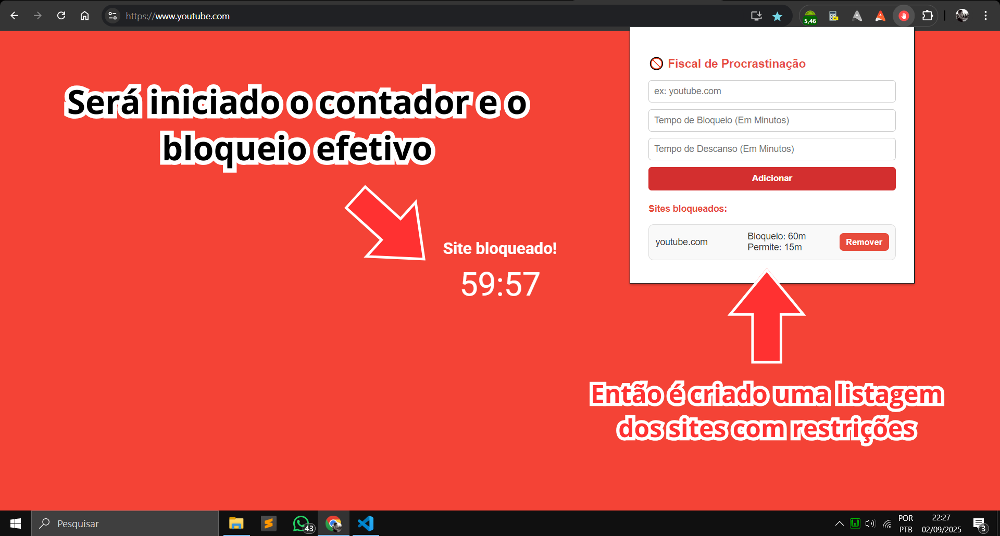
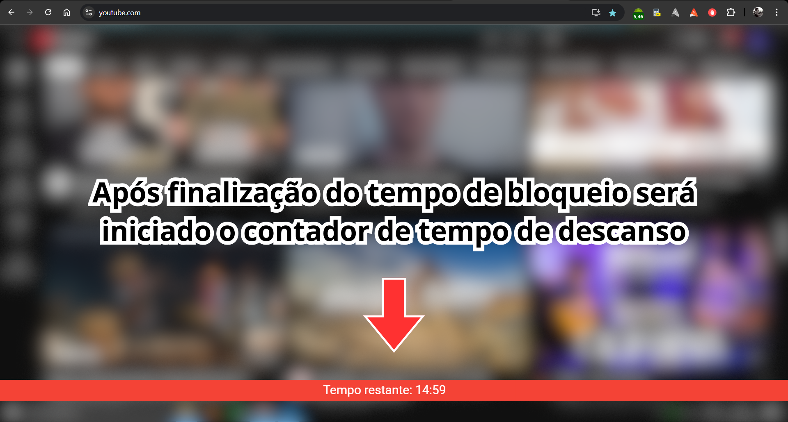

# 🚫 Fiscal de Procrastinação  

Uma extensão para Google Chrome que ajuda você a manter o foco bloqueando sites que tiram sua produtividade.  
Com o **Fiscal de Procrastinação**, você define **intervalos de bloqueio** e **pausas controladas** para acessar seus sites de distração de forma equilibrada.  

---

## 📌 Funcionalidades  

- 🔒 **Bloqueio automático** de sites adicionados à lista.  
- ⏳ **Timer de bloqueio e descanso** exibido diretamente na página.  
- 📝 **Lista de sites configurável** via popup da extensão.  
- ⚡ **Aplicação instantânea**: ao adicionar ou remover sites, o bloqueio é ativado ou desativado na hora.  
- 🔁 **Ciclos automáticos**: após o tempo de descanso, o site volta a ser bloqueado automaticamente.  
- 💾 **Armazenamento persistente** com `chrome.storage.sync`.  

---

## 🖼️ Demonstração  

### Tela da extensão (popup)
- Adicione sites para bloquear.  
- Configure tempo de **bloqueio** e **descanso** (em minutos).  
- Visualize e gerencie sua lista de sites.  

### Na página bloqueada
- Um **overlay vermelho** é exibido com um contador regressivo.  

### Durante o descanso
- Um **contador de tempo restante** aparece discretamente na tela.  

---

## 📂 Estrutura do Projeto  
fiscal-de-procrastinacao/
│── manifest.json
│
├── popup/
│   ├── popup.html
│   ├── popup.js
│   └── popup.css
│
├── content/
│   ├── content.js
│   └── content.css
│
├── icons/
│   ├── icon16.png
│   ├── icon48.png
│   └── icon128.png
│
└── README.md
